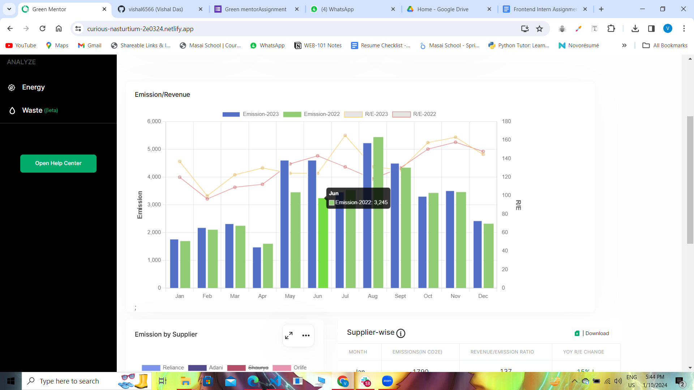

## Project (Green mentor) : Clone of https://curious-nasturtium-2e0324.netlify.app/

# Technology Stack Used

In this project we have used the following tech stack.

- HTML
- CSS
- JAVASCRIPT
- ReactJS
- Redux
- CHART JS
- CHAKRA UI

# Snapshots of Our Project 📸

# Steps to run the project locally

-git clone 'url'
-npm i
-npm run start

